# Hangman Game with Computer Vision

This is an implementation of the classic game of Hangman. The aim is to create an interactive and engaging experience where players guess the name of a movie based on provided hints, with the assistance of visual aids.

## Outline

1. **Data Processing with Pandas and IMDb Database**
    - Utilizes the **Pandas** library to process the **IMDb database**.
    - Cleansing steps include:
        - Removing unnecessary columns such as `release_year`, `cast`, `director`, `keywords`, and `tagline`.
        - Dropping rows with missing values.
        - Filtering for movie titles containing English alphanumeric characters.
        - Eliminating rows with commas within the movie title or any of the selected features.
        - Selecting movies with titles ≤ 20 characters and taglines ≤ 30 characters.
    - The final processed database is saved to a CSV file.

2. **Reading Data and Storing in Dictionary Format**
    - Reads the dataset from the CSV file and organizes it into a dictionary format: `movie_title:[year,list of keywords, tagline, director, list of cast]`.

3. **Getting Random Movie Information**
    - Randomly selects a movie from the list and retrieves all relevant information (5 features) for that movie.

4. **Selecting Hints**
    - Randomly selects three features from the five movie features.
    - If features contain lists (keywords and/or cast), selects one item randomly from the list.

5. **Hangman Template Retrieval**
    - Retrieves the hangman template, providing the structure for the game interface.

6. **Determining Character Positions**
    - Calculates the positions for each blank rectangular box based on the maximum width and height among all characters in the movie name.

7. **Drawing Blank Rectangular Boxes**
    - Renders the blank rectangular boxes representing the characters of the movie title.

8. **Game Mechanics**
    - Implements the Hangman game loop with the following logic:
        - Takes character input from the user.
        - Validates input: checks for invalid characters and duplicates.
        - Updates game state based on the correctness of the guessed character.
        - Displays feedback messages, updates Hangman figure, and tracks letters used.
        - Determines game outcome: victory or loss based on attempts and correct guesses.

9. **End of Game**
    - Reveals the movie name at the end of the game.

## Game Outputs

Below are screenshots illustrating the progression of the Hangman game:

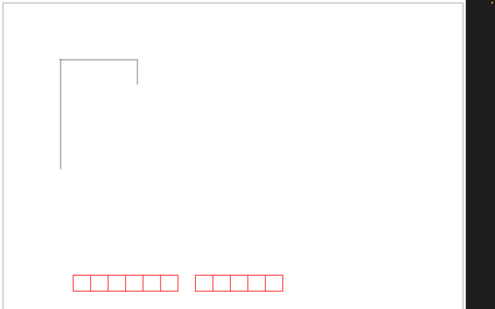
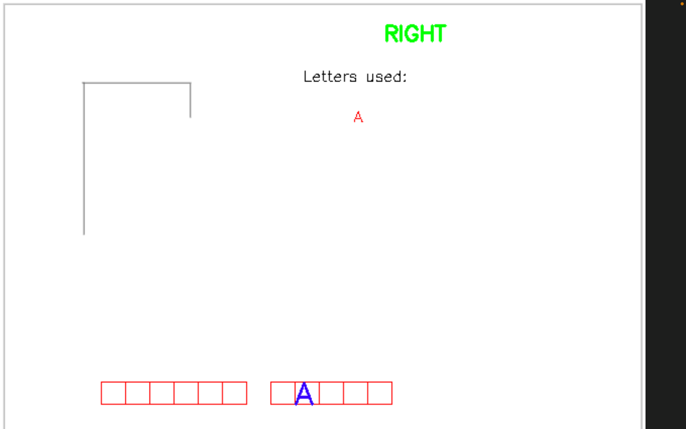
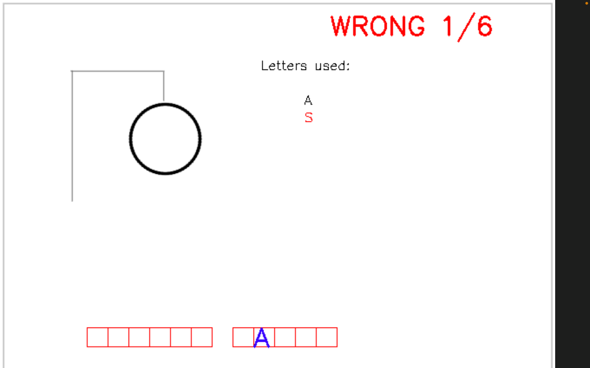
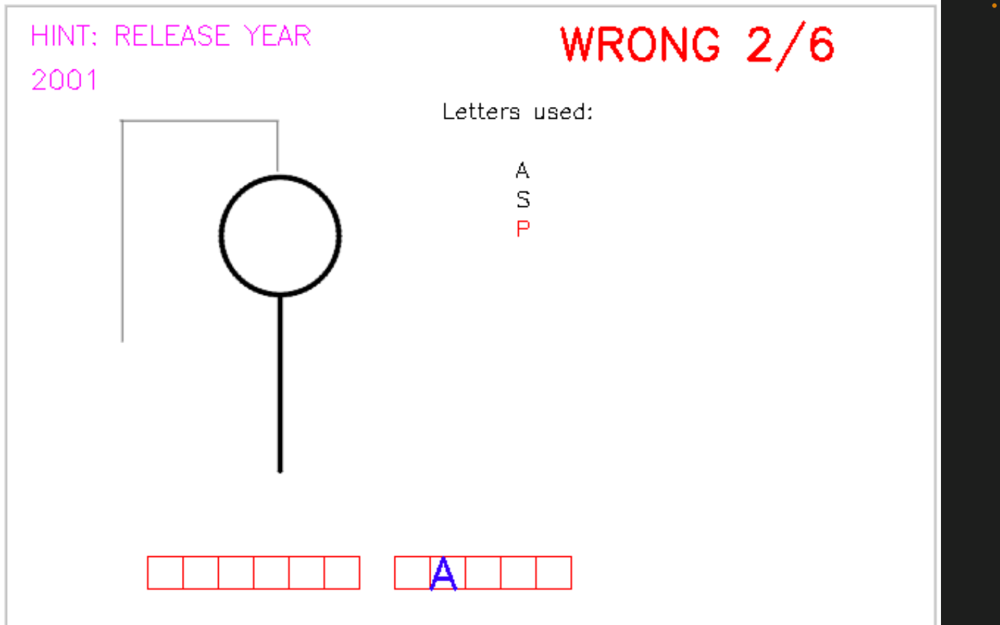
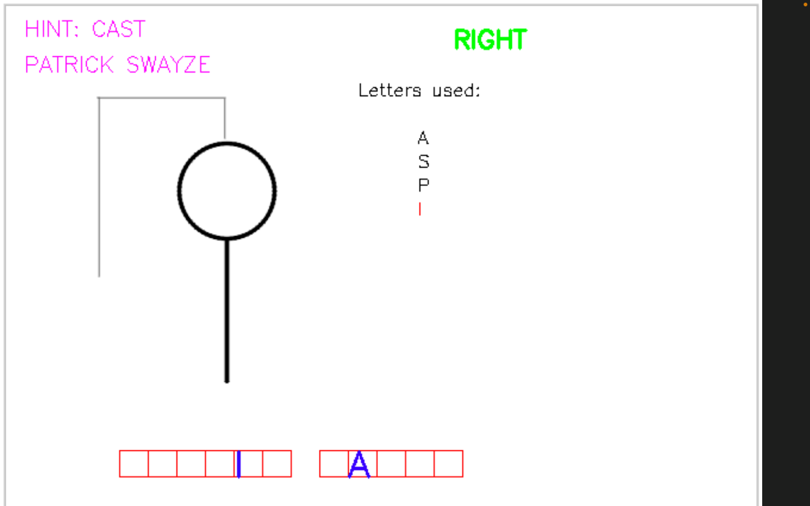
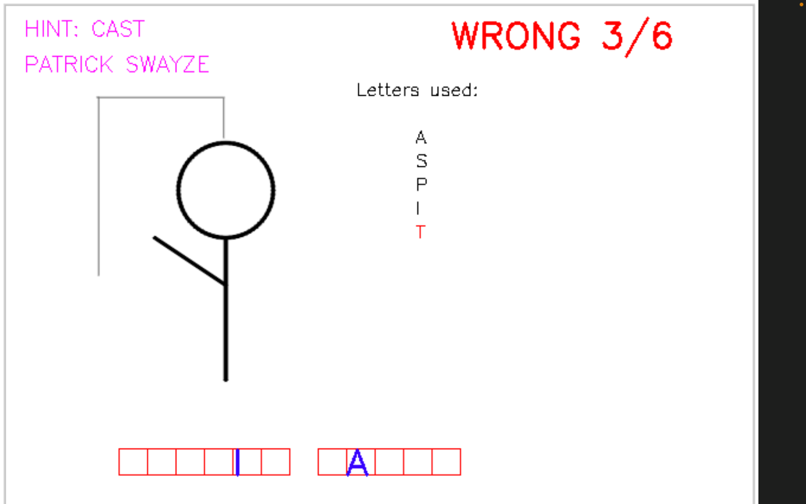
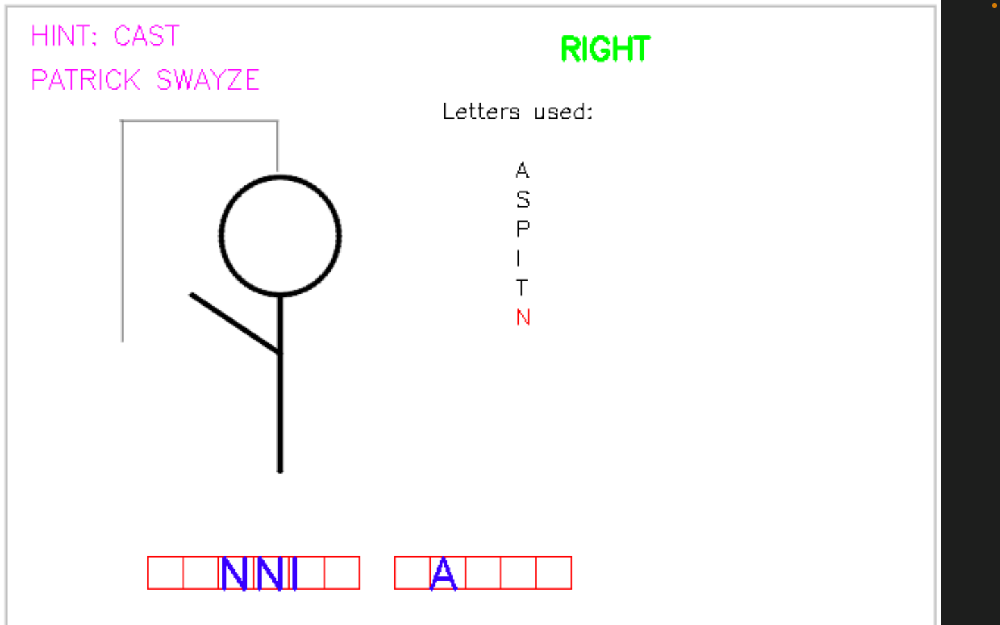
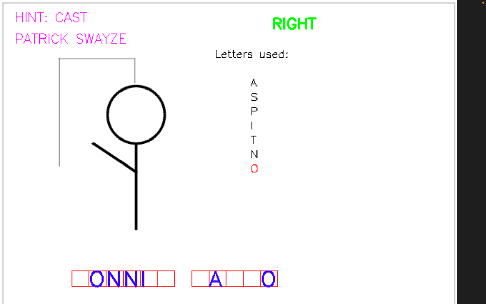
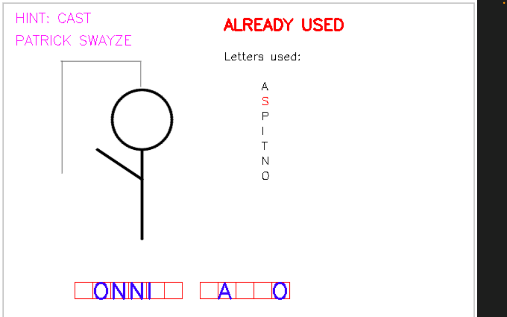
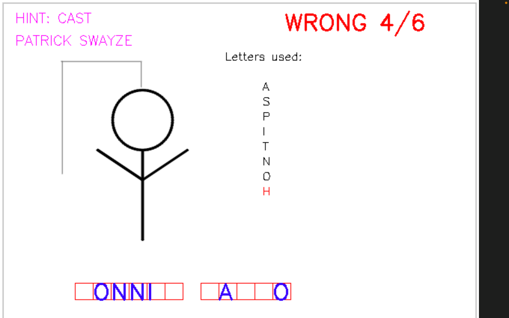
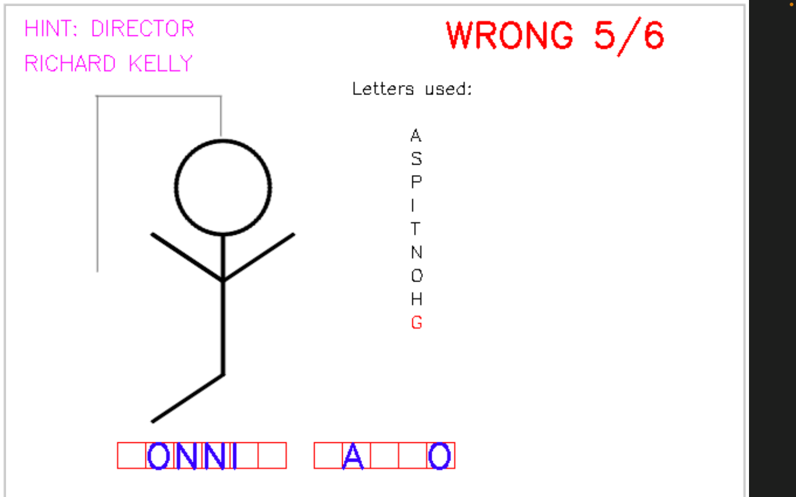
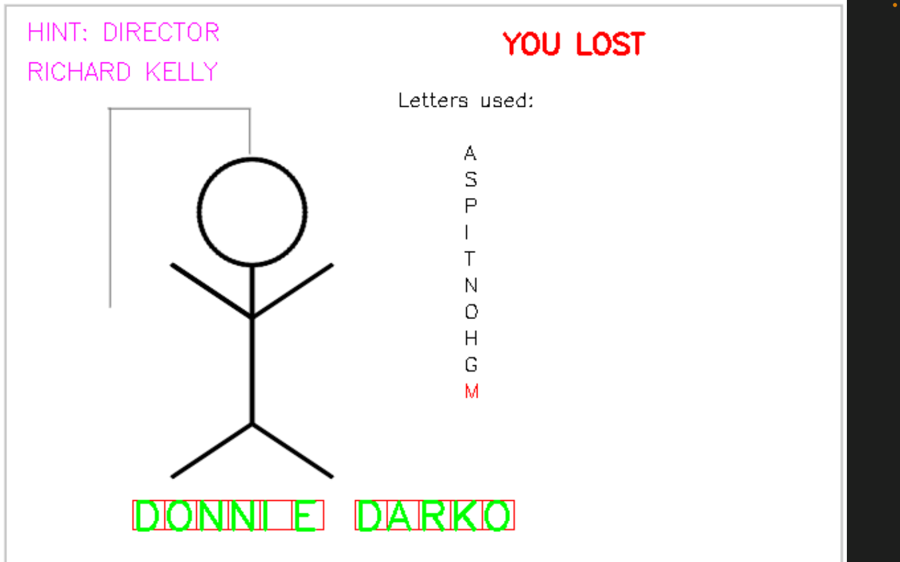

## Usage
- Ensure all dependencies are installed and the IMDb database CSV file is available.
- Run the main program to start the Hangman game.
- Follow on-screen instructions to guess the movie title and enjoy the game experience!
